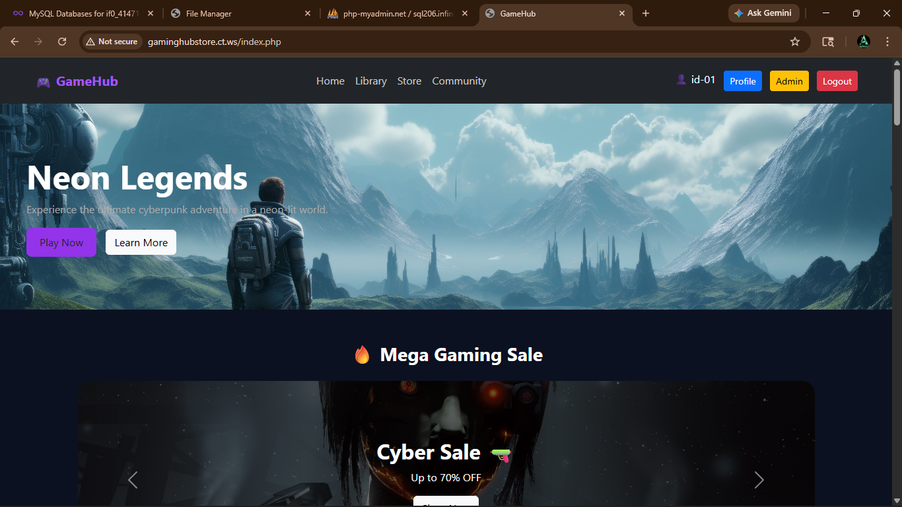
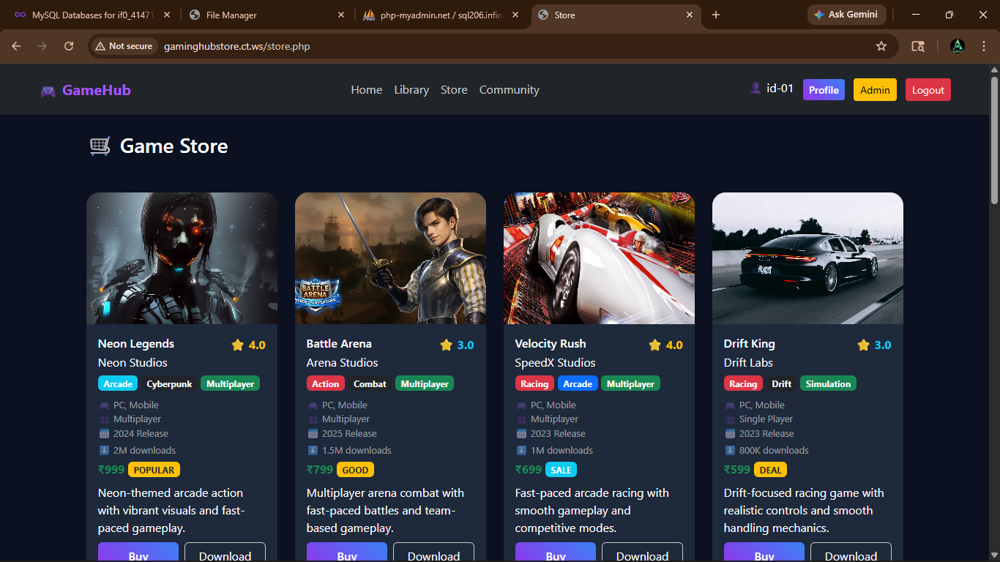
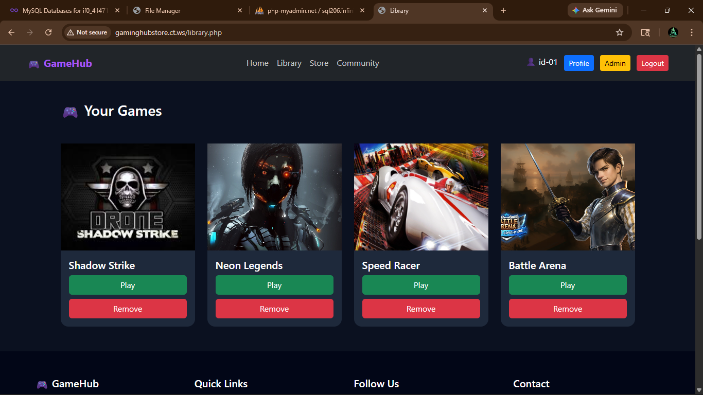
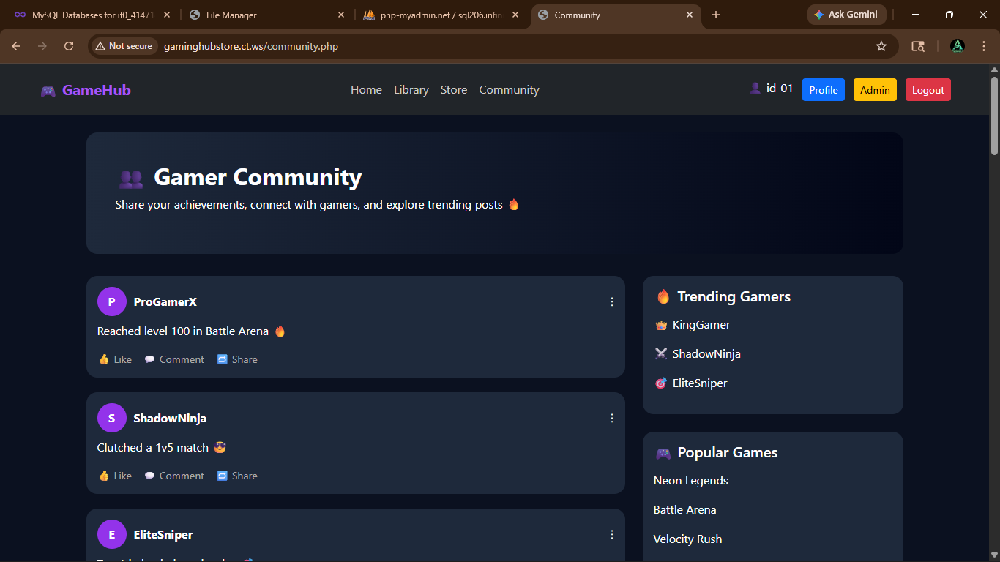

# 🎮 GameHub - Gaming Web Application

## 📌 Project Overview

GameHub is a gaming web application built using **PHP, MySQL, Bootstrap, HTML, and CSS**.
Users can explore games, download them, and manage their personal library.

---

## 🚀 Features

### 👤 User Features

* 🔐 User Authentication (Login, Signup, Forgot Password)
* 🎮 Game Store with multiple games
* ⬇️ Download games and store in user library
* 📚 Personal Library (user-specific games)
* 👥 Community Page
* 🎯 Responsive Design (Mobile Friendly)

---

### 👑 Admin Features

* 🔑 Admin Login (role-based authentication)
* 📊 Admin Dashboard with total users count
* 👥 View all users in table format
* 🔍 Search, Sorting & Pagination (DataTables)
* ✏️ Edit user details (full profile edit)
* ❌ Delete users (admin protected)
* 🚫 Block / Unblock users
* 🔐 Blocked users cannot login

---

## 🧑‍💻 Technologies Used

* Frontend: HTML, CSS, Bootstrap
* Backend: PHP
* Database: MySQL
* Library: jQuery DataTables

---

## 🗂️ Project Structure

GameHub/
│
├── index.php
├── login.php
├── signup.php
├── forgotpassword.php
├── dashboard.php
├── library.php
├── store.php
├── community.php
├── profile.php
│
├── admin.php
├── admin_edit_user.php
├── delete_user.php
├── block_user.php
│
├── login_action.php
├── signup_action.php
├── forgot_action.php
├── add_to_library.php
├── remove_game.php
│
├── db.php
├── logout.php
│
├── images/
├── uploads/

---

## ⚙️ How It Works

1. User creates an account or logs in
2. User browses games in the store
3. Clicking **Download** saves the game in database
4. Games appear in the user’s **Library page**
5. Admin can manage users (edit, delete, block)
6. Blocked users cannot access the system

---

## 🎨 UI/UX Features

* Modern card-based design
* Hover effects and animations
* Image-based carousel for offers
* Responsive layout
* Dashboard-style admin panel

---

## 🛠️ Setup Instructions

1. Install XAMPP / WAMP
2. Place project inside `htdocs`
3. Create database in phpMyAdmin
4. Import required tables
5. Update `db.php` with database credentials
6. Run project in browser

---

## 📸 Screenshots

### 🏠 Home Page

### 🎮 Store Page

### 📚 Library Page

### 👑 Admin Dashboard

---

## 📈 Future Enhancements

* ❤️ Wishlist feature
* 🔍 Advanced search & filters
* 🎥 Game trailer popup
* 🌙 Dark/Light mode toggle
* 📊 Analytics dashboard

---

## 🙌 Conclusion

This project demonstrates full-stack development with authentication, database integration, and modern UI design along with an admin management system.

---

## 👤 Author

* Bharani
